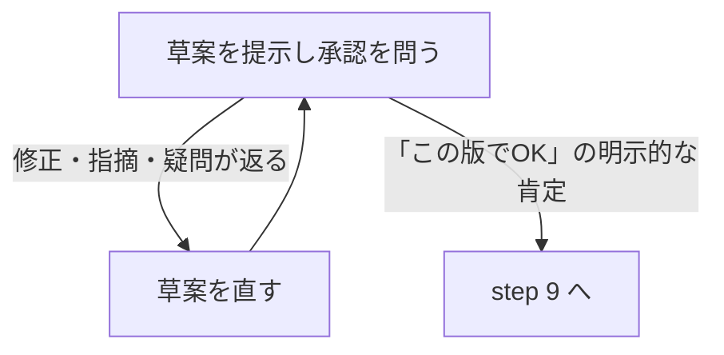

dev ブランチから main へのマージ・タグ・リリースを実行する。引数にバージョン番号（`v0.2.0` 形式）を取る。`v` プレフィックスがなければ付与する。

# 手順

## 1. 差分確認

```bash
git fetch origin
git log origin/main..origin/dev --oneline
git tag --sort=-v:refname | head -1
```

差分が 0 件なら「リリースする変更がありません」と報告して終了。

差分がある場合、コミット一覧と現在の最新タグをユーザーに提示する。引数でバージョンが指定されていなければ AskUserQuestion でバージョン番号を聞く。

## 2. バージョン定数の更新

`plugin/init.lua` の `M.version` をリリースバージョン（`v` プレフィックスなし）に更新する。現在の値と一致していればスキップ。

```bash
# 現在の値を確認
grep 'version = ' plugin/init.lua
# 更新が必要なら Edit ツールで書き換え、コミット
git add plugin/init.lua
git commit -m "chore: bump version to $VERSION"
```

## 3. dev を push

ローカル dev に未 push のコミットがあれば `git push origin dev` する。

## 4. PR 作成

dev → main の PR が既にあれば、そのまま使う（新規作成しない）。

```bash
gh pr create --base main --head dev --title "Release $VERSION" --body ""
```

## 5. CI 待ち

```bash
gh pr checks <PR番号> --watch
```

1つでも fail があれば「CI が失敗しました」と PR URL を報告して終了。

## 6. マージ

```bash
gh pr merge <PR番号> --merge --delete-branch=false
```

## 7. タグ・push

```bash
git fetch origin main
git tag $VERSION origin/main
git push origin $VERSION
```

## 8. リリースノート作成（公開前の最終ゲート）

過去のリリースノートとコミットログを取得する。

```bash
gh release list --limit 3
gh release view <直近リリース>
git log <前回タグ>..origin/main --oneline --no-merges
```

### 8-1. 載せる変化の選別

コミットは素材であって項目ではない。**前バージョンを使っていた利用者が受け取る正味の変化だけ**を書く。各論理変更を次のどちらかに分類して列挙する。

- **(a) 利用者が前バージョンから受け取る変化** — 載せる
- **(b) 本リリース内で完結した中間修正・内部都合の変更** — 載せない（利用者が一度も触れていない不具合の修正、リファクタ、CI/テスト、依存更新など）

判定の問い:「この変化は、前リリースを使っていた利用者にとって新しい体験か？」。(a) だけをノートにする。

### 8-2. 草案作成

過去のリリースノートのフォーマット・粒度・文体を踏襲し、(a) の変化を利用者が理解できる表現で Markdown にする。

### 8-3. 承認

草案を AskUserQuestion で提示し、承認を問う。**ここを越えると step 9 で取り消せない公開が走る。**



**承認の判定**: ユーザーから修正・指摘・疑問が一つでも返ったら、それは承認ではない。前の草案の承認は無効になる。直した版を改めて提示して再び承認を問う。対応完了・沈黙・問い返しを承認とみなして step 9 に進んではならない。「この版でOK」に相当する明示的な肯定だけが公開を許す。

## 9. GitHub Release 作成

```bash
gh release create $VERSION --title "$VERSION" --notes "$RELEASE_NOTES"
```

## 10. dev 同期

```bash
git checkout dev
git merge origin/main --no-edit
git push origin dev
```

## 11. 完了報告

リリース URL (`https://github.com/nakashima-takeo/wezterm-ai-agents/releases/tag/$VERSION`) を返して終了。
